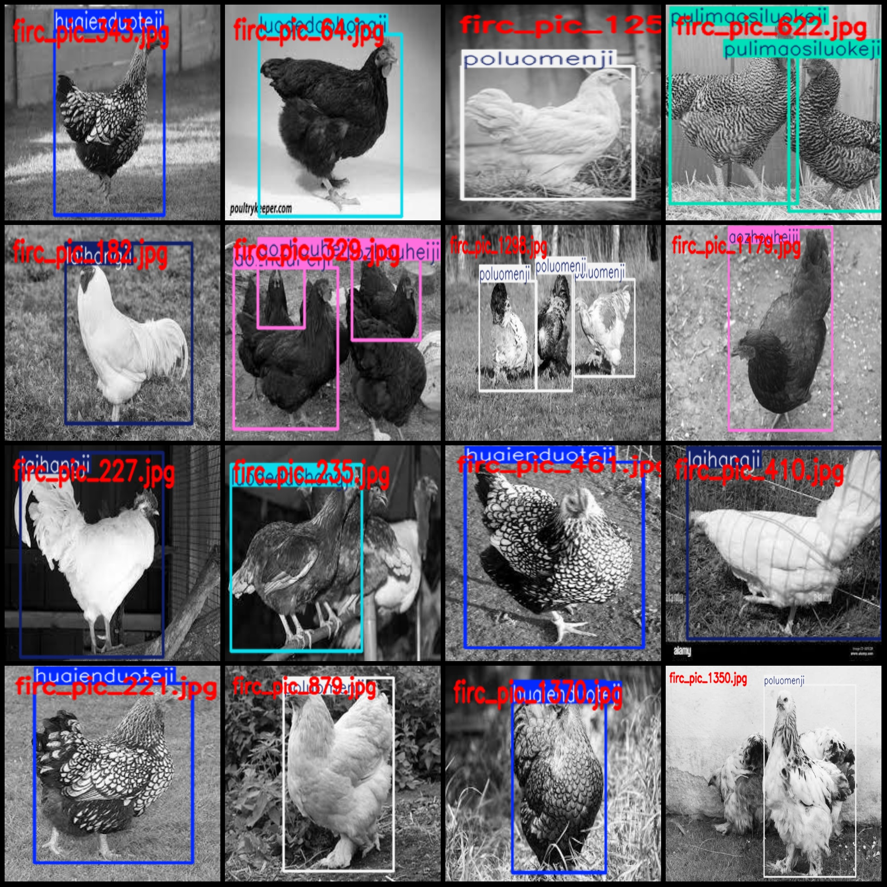
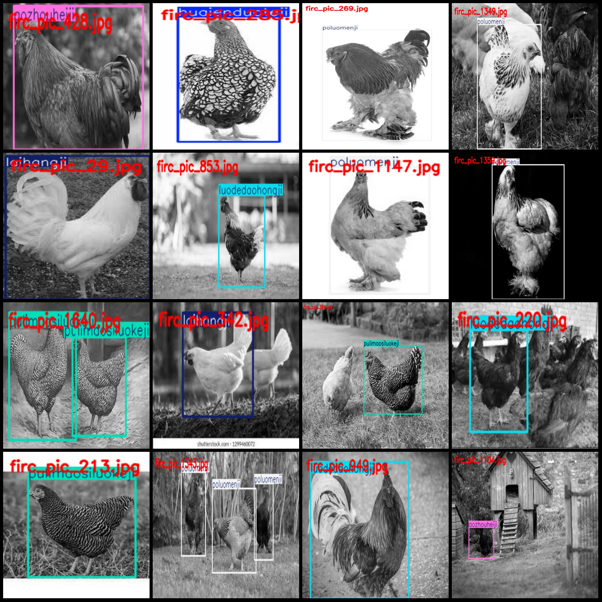

# Detecting Chicken Varieties Dataset with VOC+YOLO Format and 1670 Images in 6 Categories

Dataset format: Pascal VOC format + YOLO format (txt file without split path, only contains jpg images and corresponding VOC format xml file and yolo format txt file)
number of images: 1670  
annotation count: 1670  
annotation count: 1670  
annotationnumber of classes: 6  
Annotation class names: ["Aozhou Heiji", "Huaiyenduoteji", "Laihangji", "Luodedaohongji", "Poluomenji", "Pulimaosiluokeji"]
"Australian Black Chicken", "Wiener Doberman Chicken", "Lancaster Chicken", "Rhodes Red Chicken", "Venus Chicken", "Plymouth Rock Chicken"]
boxes per class:   
aozhouheiji box count = 402  
huaienduoteji box count = 387  
laihangji box count = 170  
luodedaohongji box count = 319  
poluomenji box count = 521  
pulimaosiluokeji box count = 162  
total boxes: 1961  
images per class:   
aozhouheiji images = 316  
huaienduoteji images = 335  
laihangji images = 148  
luodedaohongji images = 288  
poluomenji images = 437  
pulimaosiluokeji images = 146  
Image resolution refers to the number of pixels in a single image. It is measured by the width and height of the image. For example, an image with a resolution of 612x408 would have 612 pixels in width and 408 pixels in height. Similarly, an image with a resolution of 612x390 would have 612 pixels in width and 390 pixels in height.
Use the annotation tool: labelImg.
Annotation rules: Draw a rectangle around the class.
Important notes: The dataset does not have a training, validation, or test set to be divided; you need to divide it yourself.
Special statement: This dataset does not guarantee the accuracy of the trained model or weight files.
Image preview:
## Images

Here is a pay link on Stripe ( https://buy.stripe.com/3cs8yP7sY87d0vu9AB ). Please contact me lonlonago@foxmail.com after funding $89, and I will send you a complete data files , thank you!

